<!-- ===================== HEADER ===================== -->

<h1 align="center">
  
  Hi, I'm Abdul Rehman
  
</h1>

<div align="center">
  
</div>


<h3 align="center">
🛡 SOC Analyst • 🔍 Cybersecurity Analyst • 🐧 Linux Security • ☁️ AWS Monitoring • 🤖 AI Automation Learner
</h3>

<p align="center">
  <!--
  
  -->
  
</p>

<p align="center">
  
  
  
  <!--
  
  
  -->
</p>

<p align="center">
  
  
</p>

<p align="center">
  
  
  
  
  
  
</p>

<hr>

<!-- ===================== CONNECT ===================== -->

## 🌐 Connect with Me

<p align="center">
  <a href="https://twitter.com/abdul4rehman215">
     
  </a>
  <a href="https://linkedin.com/in/abdul4rehman215">
     
  </a>
  <a href="https://instagram.com/abdul4rehman215">
    
  </a>
  <a href="https://fb.com/abdul4rehman215">
    
  </a>
  <a href="https://linktr.ee/abdul4rehman215">
    
  </a>
</p>

<p align="center">
  <a href="https://wa.me/917848040230">
    
  </a>
  <a href="mailto:abdul4rehman215@gmail.com">
    
  </a>
  <a href="https://github.com/abdul4rehman215">
    
  </a>

  <a href="https://discord.com/users/abdul4rehman215">
    
  </a> 

</p>

<hr>

<!-- ===================== ABOUT ME ===================== -->

## 👨‍💻 About Me


```yaml
Name: Abdul Rehman
Role: SOC Analyst | Cybersecurity Analyst | Blue Team Portfolio Builder
Location: Bengaluru, India 🇮🇳
Primary Focus:
  - SOC Operations
  - SIEM Monitoring & Alert Triage
  - Linux Security & Hardening
  - AWS Security Monitoring
  - Incident Response Workflows
  - AI Automation for Security Operations
Current Growth Tracks:
  - n8n Automation
  - Agentic AI Workflows
  - Prompt Engineering
  - Context Design
  - RAG / Vector-Based Workflows
Approach: Build → Detect → Investigate → Automate → Document → Improve
Philosophy: Automate Everything
Goal: Become a cybersecurity expert who enhances security operations with AI automation
````

I’m a **hands-on cybersecurity practitioner** focused on **SOC operations, SIEM monitoring, Linux security, AWS visibility, incident response workflows, and open-source security tooling**.

My portfolio is built around **real lab execution and deep documentation** — not just learning tools, but **deploying, validating, investigating, documenting, and improving complete environments**.

Over time, I’ve built and documented work across:

* **SOC & SIEM operations**
* **Wazuh-based monitoring and detection**
* **TheHive / MISP / Cortex workflows**
* **Linux security hardening and administration**
* **AWS CloudTrail monitoring and cloud activity visibility**
* **Java-based cloud integration labs and backend workflow development**
* **Incident response simulations and case documentation**
* **Vulnerability validation and security review**
* **Python / Bash / Ansible automation**
* **AI automation, n8n workflows, agentic experiments, and prompt engineering**

I also completed a **full-year student internship** alongside my cybersecurity studies and have been consistently building a **large, structured GitHub portfolio** through hands-on labs, specialist repositories, and capstone-style projects.

<hr>

<!-- ===================== PORTFOLIO SNAPSHOT ===================== -->

## 📌 Portfolio Snapshot

<div align="center">

| 🔐 Portfolio Dimension                | 📈 What It Reflects                                                                     |
| ------------------------------------- | --------------------------------------------------------------------------------------- |
| **20+ structured repositories**       | Specialist tracks, capstones, guided labs, and portfolio-ready documentation            |
| **700+ hands-on labs & projects**     | Practical execution across cybersecurity, Linux, cloud, automation, and analytics       |
| **SOC + SIEM + IR depth**             | Wazuh, TheHive, MISP, Cortex, alert triage, enrichment, MITRE mapping, case workflows   |
| **Linux / RHEL / Admin strength**     | Hardening, services, access control, logging, troubleshooting, automation               |
| **Cloud monitoring exposure**         | AWS visibility, CloudTrail awareness, IAM activity review, cloud lab operations         |
| **10+ n8n / AI automation workflows** | Agentic experiments, workflow prototyping, RAG basics, AI-assisted process automation   |
| **Documentation-first mindset**       | Strong READMEs, notes, architecture diagrams, workflow mapping, and technical reporting |

</div>

<hr>

<!-- ===================== FULL SKILL MATRIX ===================== -->

## 📊 Full Skill Matrix

This matrix reflects my **portfolio-wide hands-on implementation** across SOC operations, SIEM, Linux security, AWS monitoring, incident response, automation, AI automation, and analytics.

> Exposure bars reflect practical breadth across repositories, capstones, self-built labs, workflow experiments, and documented hands-on projects.

| Skill Area | Exposure Level | Practical Depth | Tools / Frameworks Used |
|---|---:|---|---|
| 🛡️ SOC Operations & Alert Triage | ██████████ **100%** | Alert triage, investigation logic, false-positive review, escalation context, analyst-style documentation | Wazuh, TheHive, MITRE ATT&CK |
| 📊 SIEM Monitoring & Detection Engineering | ██████████ **100%** | Wazuh monitoring, rules, decoders, FIM, alert visibility, validation, detection-focused workflows | Wazuh, ELK, Kibana, Sysmon |
| 🧾 Incident Response & Case Documentation | █████████░ **95%** | Alert-to-case thinking, response notes, investigation timelines, lessons learned, structured reporting | TheHive, MISP, SOC reporting workflows |
| 🧠 Threat Intelligence & ATT&CK Mapping | █████████░ **95%** | IOC enrichment, ATT&CK mapping, investigation context building, alert enrichment support | MISP, Cortex, VirusTotal, MITRE ATT&CK |
| 🐧 Linux Security & System Hardening | ██████████ **100%** | SSH hardening, permissions, services, auditing, logging, firewalling, admin troubleshooting | Linux, Ubuntu, Debian, RHEL, auditd, ufw, fail2ban |
| ☁️ AWS Security Monitoring & Cloud Visibility | █████████░ **90%** | CloudTrail monitoring, IAM activity awareness, cloud event visibility, AWS lab security observation | AWS, CloudTrail, AWS CLI |
| ☕ Java & Cloud Integration | ████████░░ **85%** | Java-based cloud integration labs, backend service workflows, practical implementation, and integration-oriented development exposure | Java, backend integration labs, cloud workflows |
| 🧪 Vulnerability Assessment & Security Validation | █████████░ **90%** | Vulnerability review, hardening validation, scan interpretation, security posture improvement thinking | Nessus, OpenVAS, CIS benchmarks |
| 🌐 Web / Network Security Observation | ████████░░ **85%** | Traffic review, service visibility, Nginx / web log observation, safe testing-lab workflows | Wireshark, Nmap, Burp Suite, OWASP ZAP, Nginx, pfSense |
| ⚙️ Scripting, Workflow Support & Automation | █████████░ **90%** | Bash/Python helper scripts, admin automation, log parsing, repeatable workflow execution | Python, Bash, PowerShell, Ansible |
| 🤖 AI Automation & Agentic Workflows | ████████░░ **85%** | n8n workflow prototyping, prompt engineering, context design, agentic experiments, AI-assisted task automation | n8n, LLM workflows, RAG concepts, vector workflows |
| 🎩 RHEL, Containers & Admin Automation | ████████░░ **85%** | Enterprise-style administration exposure, container workflows, operational consistency, system management | RHEL, Podman, Docker, Kubernetes, OpenShift |
| 📈 Data Analytics & Security-Oriented Analysis | ████████░░ **85%** | Python-based analysis, data handling, visualization, statistics, ML/NLP foundations, analytical reasoning | Jupyter, Pandas, NumPy, Matplotlib, scikit-learn |

## 🔍 Proficiency Scale

- ██████████ = High practical exposure across multiple repositories, labs, capstones, and repeat implementations
- █████████░ = Strong applied experience with clear portfolio depth and documented workflows
- ████████░░ = Solid working implementation with growing depth and continued expansion

This matrix reflects **overall portfolio capability**, not one isolated repository — covering:

> SOC → Detection → Investigation → Enrichment → Hardening → Monitoring → Automation → Documentation → Continuous Improvement

<hr>

<!-- ===================== CORE FOCUS ===================== -->

## 🎯 Core Focus Areas

<div align="center">

| 🧭 Domain                       | 🔍 Focus                                                                                      |
| ------------------------------- | --------------------------------------------------------------------------------------------- |
| **SOC Operations**              | alert triage, case context, event analysis, escalation thinking, documentation                |
| **SIEM & Detection**            | Wazuh monitoring, rules, decoders, FIM, visibility tuning, vulnerability detection            |
| **Incident Response Workflows** | investigation flow, IOC enrichment, MITRE ATT&CK mapping, reporting, lessons learned          |
| **Linux Security**              | hardening, SSH security, permissions, auditing, services, system defense                      |
| **AWS Monitoring**              | CloudTrail visibility, IAM event awareness, cloud activity review, cloud security observation |
| **Automation**                  | Python, Bash, Ansible, workflow design, repetitive task reduction                             |
| **AI Automation**               | n8n, agentic workflows, prompt engineering, context design, automation prototyping            |
| **Security Analytics**          | data thinking, statistics, ML/NLP foundations, security-oriented analytical reasoning         |

</div>

<hr>

<!-- ===================== FEATURED PROJECTS ===================== -->

## 🚀 Featured Portfolio Highlights

### 🛡 1) End-to-End SOC + SOAR Security Ecosystem on AWS

A flagship **open-source security operations environment** built around detection, alerting, triage, investigation, case handling, response support, and feedback-driven improvement.

**Highlights:**

* Wazuh SIEM deployment and monitoring
* TheHive case management workflows
* MISP threat intelligence enrichment
* Cortex analyzer integration
* MITRE ATT&CK-aligned investigation thinking
* AWS-hosted security lab architecture
* Alert-to-case operational flow
* Structured documentation, workflows, and architecture diagrams

---

### 🔎 2) Cyber Defense / Detection Engineering Lab Portfolio

A structured defensive-security portfolio focused on **monitoring, visibility, alert understanding, incident logic, and blue-team workflows**.

**Highlights:**

* Windows and Linux detection scenarios
* Sysmon-aligned visibility
* SIEM alert validation and investigation
* Threat simulation in controlled lab settings
* Detection workflows with practical documentation
* Security operations reasoning beyond simple tool installation

---

### 🐧 3) Linux Security Administration & Hardening Portfolio

A large body of work centered on **Linux administration, system hardening, service control, access security, and enterprise-style operational discipline**.

**Highlights:**

* SSH hardening
* user, group, and privilege management
* firewall and access restriction
* service monitoring and troubleshooting
* auditing, logging, and baseline defense
* backup, recovery, and maintenance workflows

---

### 🎩 4) Red Hat / Enterprise Administration / Automation Track

A portfolio direction showing growth in **RHEL administration, repeatable operations, automation, container workflows, and security-conscious system management**.

**Highlights:**

* RHEL-focused administration
* SELinux / AppArmor exposure
* Ansible usage and automation workflows
* Podman / container exposure
* system consistency and operational repeatability
* security-first enterprise administration foundations

---

### ☁️ 5) AWS Security Monitoring & Cloud Visibility Labs

Hands-on work around **cloud logging, IAM-related activity awareness, event visibility, and practical cloud monitoring use cases**.

**Highlights:**

* CloudTrail monitoring
* IAM event awareness
* login and activity visibility
* cloud-side action review
* security observation in AWS lab environments
* cloud monitoring documentation and validation

---

### 🧪 6) Vulnerability Management / Security Validation Labs

Hands-on exposure to **vulnerability review, hardening validation, security checks, and remediation-oriented analysis**.

**Highlights:**

* vulnerability assessment workflows
* configuration review and hardening validation
* security posture observation
* scan result interpretation
* practical improvement mindset
* documentation-backed validation

---

### 🤖 7) AI Automation / n8n / Agentic Workflow Experiments

An active and growing track focused on **automating repetitive workflows, building AI-assisted task chains, testing agentic ideas, and learning how automation can improve real operations**.

**Highlights:**

* Autonomous Browser Agent
* Email Responder Multi-AI Agent
* AI Voice Email Sender Agent
* LinkedIn Content Creator Agent
* Inventory Management RAG workflow
* prompt engineering and context design practice
* workflow testing in safe learning environments
* growing focus on operational AI automation

---

### 📊 8) Python, Data Science & Security Analytics Foundations

A parallel skill track strengthening **scripting, analytical reasoning, automation potential, and data-driven thinking for technical/security-adjacent use cases**.

**Highlights:**

* Python foundations
* Pandas / NumPy workflows
* visualization and exploratory analysis
* statistics and probability
* machine learning foundations
* NLP exposure
* time-series exposure
* deep learning foundations

<hr>

<!-- ===================== FUTURE VISION ===================== -->

## 🚀 Future Vision

I want to become a **cybersecurity expert** who strengthens and scales security operations through **AI automation**.

My long-term goal is to understand **how security teams, SOC workflows, investigations, monitoring pipelines, reporting, triage, and repetitive operational tasks can be improved through intelligent automation**.

I believe this direction matters because:

* security challenges are growing rapidly
* AI is reshaping how work gets done
* many repetitive tasks in security can be automated
* better automation can improve analyst efficiency
* AI-assisted operations can become more practical and cost-effective even for **small organizations**

That is why I’m actively growing in:

* **AI automation**
* **agentic workflows**
* **prompt engineering**
* **workflow orchestration**
* **security + automation integration**
* **the idea of automating everything that should be automated**

<hr>

<!-- ===================== TECHNICAL SKILLS ===================== -->

## 🛠 Technical Skills

<details open>
<summary><b>🚀 Click to Expand / Collapse Technical Skills</b></summary>

### ☁️ Cloud & Platform Security

<p align="left">
  
  
</p>

### 🐳 Containers & Runtime

<p align="left">
  
  
  
  
</p>

### 🔐 Security, SOC & Threat Detection

<p align="left">
  
  
  
  
  
  
  
  
  
  
  
  
  
</p>

### 📊 SIEM, Logging & Case Management

<p align="left">
  
  
  
  
  
  
  
  
</p>

### 🌐 Networking & Traffic Analysis

<p align="left">
  
  
  
  
</p>

### 🐧 Operating Systems

<p align="left">
  
  
  
  
  
  
</p>

### 🧪 Programming, Automation & Analysis

<p align="left">
  
  
  
  
  
  
</p>

### ☕ Java & Integration Development

<p align="left">
  
  
  
</p>

### 🤖 AI Automation, Agentic Workflows & Prompting

<p align="left">
  
  
  
  
  
  
  
</p>

### 📈 Data Science, ML & Security Analytics

<p align="left">
  
  
  
  
  
  
  
  
</p>

</details>

<hr>

<!-- ===================== WHAT I WORK ON ===================== -->

## 🛡 What I Work On

### 🔍 SOC Operations & SIEM Monitoring

* alert triage and investigation thinking
* Wazuh monitoring, visibility checks, and detection workflows
* event interpretation, false-positive review, and escalation context
* case-oriented analysis and reporting mindset

### 🧠 Threat Intelligence & Incident Context

* IOC review and enrichment
* TheHive / MISP / Cortex-oriented workflows
* MITRE ATT&CK mapping and analyst context building
* structured investigation and response documentation

### 🐧 Linux Security & Administration

* hardening Linux systems and services
* SSH security, privilege control, permissions, and access management
* logging, auditing, and service monitoring
* troubleshooting and security-minded system administration

### ☁️ AWS Security Monitoring

* CloudTrail visibility and activity review
* IAM-related event awareness
* monitoring cloud actions in lab environments
* cloud security observation and documentation

### ☕ Java & Cloud Integration Labs

* Java-based cloud integration lab work
* backend workflow understanding and service interaction
* practical implementation exposure through integration-focused labs
* growing development-side understanding alongside security operations

### 🤖 AI Automation & Workflow Prototyping

* n8n-based workflow building
* multi-step automation experiments
* prompt engineering and context design practice
* AI-assisted task automation in learning environments
* exploring how automation can support modern security operations

### ⚙️ Automation & Workflow Thinking

* Bash / Python scripting for operational support
* Ansible and repeatable admin tasks
* structured documentation-backed execution
* reducing repetitive work through automation-first thinking

<hr>

<!-- ===================== CERTIFICATIONS ===================== -->

## 🏅 Certifications & Professional Training

* **EduQual RQF Level 3 Diploma in Cloud Cyber Security** — *Al-Nafi International College* *(in progress)*
* **Cyber Security Internship** — *Al-Nafi International College* *(in progress)*
* **Cloud Cyber Security Course Completion** — *Al-Nafi International College*
* **Certified in Cybersecurity (CC)** — *ISC2*
* **SOC Analyst & Cybersecurity Job Simulations** — *FORAGE* *(TATA, Deloitte, AIG, Datacom, Telstra, Datacom, Commonwealth Bank)*
* **ISO/IEC 27001:2022 Lead Auditor** — *Mastermind*
* **Certified Phishing Prevention Specialist (CPPS)** — *Hack & Fix*
* **Certified Threat Intelligence & Governance Analyst (CTIGA)** — *Red Team Leaders*
* **Certified Red Team Operations Management (CRTOM)** — *Red Team Leaders*
* **AI Masterclass & Workshops** — *Dhruv Rathee Academy, GrowthSchool, be10x*
* **AWS DevOps and Agentic AI Masterclass** — *Train with Shubham*
* **Data Analytics Essentials** — *Cisco Networking Academy*
* **Certified Fundamentals in Cybersecurity** — *Fortinet*
* **Cybersecurity Fundamentals & SOC in Practice** — *IBM SkillsBuild*
* **Enterprise Security in Practice** — *IBM SkillsBuild*
* **Threat Intelligence & Hunting Fundamentals** — *IBM SkillsBuild*
* **Artificial Intelligence Fundamentals** — *IBM SkillsBuild*

<p align="center">
   <a href="https://www.credly.com/users/abdul4rehman215" target="_blank">
    
  </a>
   <a href="https://www.credly.com/users/abdul4rehman215" target="_blank">
    
  </a>
</p>

<hr>

<!-- ===================== PROFESSIONAL FOCUS ===================== -->
<h2>💼 Professional Focus</h2>

<table width="100%">
  <tr>
    <th width="35%" align="left">🧭 Current Strengths</th>
    <th width="65%" align="left">🚀 Areas I’m Actively Advancing</th>
  </tr>
  <tr>
    <td valign="top" width="35%">
      <strong>SOC Operations &amp; Defensive Security</strong>
      <ul>
        <li>SOC alert monitoring, triage, and analyst-style investigation thinking</li>
        <li>SIEM monitoring and incident analysis using <strong>Wazuh</strong></li>
        <li>Threat detection, IOC context, and <strong>MITRE ATT&amp;CK</strong> mapping</li>
        <li>Incident escalation, reporting, and structured case documentation</li>
        <li>Linux security, log analysis, hardening, and operational administration</li>
        <li>AWS monitoring visibility through <strong>CloudTrail</strong> and activity review</li>
        <li>Open-source SOC ecosystem exposure with <strong>Wazuh + TheHive + MISP + Cortex</strong></li>
      </ul>
    </td>
    <td valign="top" width="65%">
      <strong>Security Growth, Engineering Depth &amp; AI Automation Direction</strong>
      <ul>
        <li>Deepening detection logic, alert quality tuning, and stronger SOC decision-making</li>
        <li>Expanding SIEM depth in <strong>Wazuh</strong>: rules, decoders, FIM, and vulnerability detection</li>
        <li>Advancing threat intelligence handling, enrichment workflows, and ATT&amp;CK-aligned analysis</li>
        <li>Growing stronger in Linux security engineering, hardening strategy, and enterprise administration</li>
        <li>Building more mature AWS security monitoring and cloud visibility understanding</li>
        <li>Improving Python, Bash, Ansible, and automation-first workflow execution</li>
        <li>Learning <strong>AI automation</strong>, <strong>n8n</strong>, agentic workflows, prompt engineering, and context design</li>
        <li>Exploring how repetitive SOC and security operations tasks can be automated efficiently</li>
        <li>Strengthening documentation quality, project storytelling, and portfolio presentation</li>
        <li>Moving toward becoming a cybersecurity expert who enhances security operations through AI automation</li>
      </ul>
    </td>
  </tr>
</table>

<hr />

<!-- ===================== FEATURED CAPSTONE PROJECTS ===================== -->
<h2>🚀 Featured Capstone Projects</h2>

<table>
  <tr>
    <th width="50%">🛡️ SOC Capstone — Malware Detection &amp; Analysis</th>
    <th width="50%">📑 SOC Capstone — Incident Response &amp; Case Handling</th>
  </tr>
  <tr>
    <td valign="top">
      <strong>🔎 Malware Detection Workflow</strong>
      <ul>
        <li>Simulated suspicious / malicious activity in controlled lab environments</li>
        <li>Used Wazuh + endpoint telemetry for detection visibility and alert review</li>
        <li>Practiced analyst-style triage, validation, and event interpretation</li>
        <li>Documented findings in a portfolio-first, investigation-driven format</li>
      </ul>
      <p align="left">
        <a href="https://github.com/abdul4rehman215?tab=repositories&q=malware">
          
        </a>
        <a href="https://www.linkedin.com/posts/abdul4rehman215_soc-capstone-project-malware-detection-and-activity-7430280092578172943-Avqu?utm_source=share&utm_medium=member_desktop&rcm=ACoAAEuho14BQnjOksWA5iihN6dnsE3C-o3yBUU">
          
        </a>
      </p>
    </td>
    <td valign="top">
      <strong>📋 Incident Response Workflow</strong>
      <ul>
        <li>Followed alert-to-investigation thinking for SOC-style incident handling</li>
        <li>Built documentation around investigation steps, findings, and response logic</li>
        <li>Practiced structured case handling, reporting, and analyst communication</li>
        <li>Strengthened IR workflow discipline through hands-on portfolio labs</li>
      </ul>
      <p align="left">
        <a href="https://github.com/abdul4rehman215?tab=repositories&q=incident">
          
        </a>
        <a href="https://www.linkedin.com/posts/abdul4rehman215_soc-capstone-project-incident-response-activity-7430997244033658880-uzzZ?utm_source=share&utm_medium=member_desktop&rcm=ACoAAEuho14BQnjOksWA5iihN6dnsE3C-o3yBUU">
          
        </a>
      </p>
    </td>
  </tr>
  <tr>
    <th width="50%">☁️ Open-Source SOC + SOAR Ecosystem on AWS</th>
    <th width="50%">🤖 AI-Driven SOC Triage &amp; Automation</th>
  </tr>
  <tr>
    <td valign="top">
      <strong>🧩 End-to-End Security Operations Build</strong>
      <ul>
        <li>Built an open-source SOC ecosystem around <strong>Wazuh + TheHive + MISP + Cortex</strong></li>
        <li>Connected SIEM alerting, enrichment, case handling, and analyst workflows</li>
        <li>Extended visibility with AWS monitoring, documentation, architecture, and capstone reporting</li>
        <li>Showcased operational thinking beyond single-tool deployment</li>
      </ul>
      <p align="left">
        <a href="https://github.com/abdul4rehman215?tab=repositories&q=wazuh">
          
        </a>
        <a href="https://www.linkedin.com/posts/abdul4rehman215_soc-soar-cybersecurity-activity-7431722094020816896-UKtd?utm_source=share&utm_medium=member_desktop&rcm=ACoAAEuho14BQnjOksWA5iihN6dnsE3C-o3yBUU">
          
        </a>
        <a href="https://www.linkedin.com/posts/abdul4rehman215_socarchitecture-soar-securityengineering-activity-7431359622495510528-ZYVd?utm_source=share&utm_medium=member_desktop&rcm=ACoAAEuho14BQnjOksWA5iihN6dnsE3C-o3yBUU">
          
        </a>
        <a href="https://www.linkedin.com/posts/abdul4rehman215_soc-soar-blueteam-activity-7432088167048167424-7xns?utm_source=share&utm_medium=member_desktop&rcm=ACoAAEuho14BQnjOksWA5iihN6dnsE3C-o3yBUU">
          
        </a>
      </p>
    </td>
    <td valign="top">
      <strong>⚙️ AI-First SOC Workflow Direction</strong>
      <ul>
        <li>Explored AI-assisted SOC triage, workflow acceleration, and analyst support concepts</li>
        <li>Practiced <strong>n8n</strong>, prompt engineering, context design, and agentic workflow building</li>
        <li>Built automation experiments for repetitive operational tasks and response support</li>
        <li>Aligned long-term goal with AI automation for security operations</li>
      </ul>
      <p align="left">
        <a href="https://github.com/abdul4rehman215?tab=repositories&q=automation">
          
        </a>
        <a href="https://www.linkedin.com/posts/abdul4rehman215_ai-driven-soc-triage-automation-using-wazuh-activity-7433537734859751424-DIzc?utm_source=share&utm_medium=member_desktop&rcm=ACoAAEuho14BQnjOksWA5iihN6dnsE3C-o3yBUU">
          
        </a>
        <a href="https://www.linkedin.com/posts/abdul4rehman215_aifirstsoc-soc-soar-activity-7434624890126708736-XUa1?utm_source=share&utm_medium=member_desktop&rcm=ACoAAEuho14BQnjOksWA5iihN6dnsE3C-o3yBUU">
          
        </a>
        <a href="https://www.linkedin.com/posts/abdul4rehman215_socarchitecture-soar-aiautomation-activity-7433900113137315840-ly49?utm_source=share&utm_medium=member_desktop&rcm=ACoAAEuho14BQnjOksWA5iihN6dnsE3C-o3yBUU">
          
        </a>
        <a href="https://www.linkedin.com/posts/abdul4rehman215_soc-aiautomation-cybersecurity-activity-7435406994892652544-g8zH?utm_source=share&utm_medium=member_desktop&rcm=ACoAAEuho14BQnjOksWA5iihN6dnsE3C-o3yBUU">
          
        </a>
      </p>
    </td>
  </tr>
</table>

<hr />

<!-- ===================== CAPSTONE ARCHITECTURE & WORKFLOW ===================== -->

## 🏗️ Capstone Architecture & Workflow

This section highlights the **end-to-end architecture, analyst workflow, and threat-intelligence feedback loop** behind my SOC / SOAR capstone work using **Wazuh, TheHive, Cortex, MISP, AWS, and Sysmon**.

### 🔍 End-to-End SOC Analyst Workflow

<p align="center">
  
</p>

<details>
<summary><b>🧩 View SOC / SOAR Architecture Pipeline Diagram</b></summary>

<br>

<p align="center">
  
</p>

</details>

<details>
<summary><b>📐 View Mermaid Workflow Diagram</b></summary>

<br>


</details> <hr> 

<!-- ===================== GITHUB ANALYTICS ===================== -->

```mermaid
flowchart LR
  %% =========================================================
  %% SOC + SOAR + TI — End-to-End Workflow (Swimlanes, Boxed)
  %% with stronger lane separators (GitHub Mermaid friendly)
  %% =========================================================

  A_ENR[" "]:::anchor
  A_IR[" "]:::anchor
  A_TI[" "]:::anchor
  A_FB1[" "]:::anchor
  A_FB2[" "]:::anchor

  F1[" "]:::frame
  F2[" "]:::frame
  F3[" "]:::frame
  F4[" "]:::frame
  F5[" "]:::frame
  F6[" "]:::frame

  F1 -.-> F2
  F2 -.-> F3
  F3 -.-> F4
  F4 -.-> F5
  F5 -.-> F6

  subgraph L1[" "]
    direction TB
    H1["🪟 Endpoint"]:::laneHeader
    SIM["🧨 Controlled Attack Simulation<br/>PowerShell • DNS • File Drop • Persistence • Network"]:::stage
    ENDPOINT["Sysmon + Wazuh Agent<br/>Telemetry collection"]:::stage
    H1 --> SIM --> ENDPOINT --> F1
  end

  subgraph L2[" "]
    direction TB
    H2["🛡️ SIEM / XDR (Wazuh)"]:::laneHeader
    WAZ["Wazuh Manager<br/>Rules • Correlation • Alerts"]:::stage
    IDX["Wazuh Indexer<br/>OpenSearch"]:::stage
    WDASH["Wazuh Dashboard<br/>Hunting • Evidence • Discover"]:::stage
    H2 --> WAZ --> IDX --> WDASH --> F2
  end

  subgraph L3[" "]
    direction TB
    H3["👨‍💻 SOC Analyst"]:::laneHeader
    ANALYST["Triage + Investigation<br/>Review ➜ Correlate ➜ Extract IOCs"]:::human
    GATE["Decision Gate<br/>True Positive confirmed?"]:::decision
    H3 --> ANALYST --> GATE --> F3
  end

  subgraph L4[" "]
    direction TB
    H4["🗂️ Case Mgmt + SOAR (TheHive + Cortex)"]:::laneHeader
    THEHIVE["TheHive Case<br/>Alert ➜ Case ➜ Tasks ➜ Timeline"]:::stage
    OBS["Observables / IOCs<br/>Hash • Domain • IP • URL • File • Registry"]:::stage
    CORTEX["Cortex Automation<br/>Analyzers / Responders"]:::stage
    ENR["Enrichment Results<br/>VT • OTX • MISP lookups etc."]:::stage
    MITRE["MITRE ATT&CK Mapping<br/>Evidence ➜ Techniques ➜ TTPs"]:::stage

    H4 --> THEHIVE --> OBS --> A_ENR
    A_ENR --> CORTEX --> ENR --> A_ENR
    ENR --> THEHIVE
    THEHIVE --> MITRE --> A_IR --> F4
  end

  subgraph L5[" "]
    direction TB
    H5["🛠️ Incident Response"]:::laneHeader
    IRFLOW["IR Lifecycle<br/>Identify ➜ Analyze ➜ Contain ➜ Eradicate ➜ Recover ➜ Review"]:::ir
    ACTIONS["Endpoint Actions<br/>Triage • Kill proc • Block C2 • Remove persistence • Export EVTX"]:::action
    CLOSE["Case Closure<br/>Final report • Timeline • Metrics • Lessons learned"]:::outcome

    H5 --> IRFLOW --> ACTIONS --> IRFLOW
    IRFLOW --> CLOSE --> A_TI --> F5
  end

  subgraph L6[" "]
    direction TB
    H6["🧠 Threat Intelligence (MISP)"]:::laneHeader
    MISP["MISP Event<br/>Validated IOCs + Tags + Context"]:::ti
    SHARE["Share / Reuse<br/>Correlation • Community • Future detections"]:::ti
    H6 --> MISP --> SHARE --> F6
  end

  ENDPOINT -->|📤 Sysmon telemetry| WAZ
  WDASH --> ANALYST
  GATE -->|📌 Escalate IOCs + evidence| THEHIVE
  A_IR --> IRFLOW
  A_TI -->|✅ Export validated IOCs| MISP

  SHARE -.-> A_FB1 -.->|♻️ Improve detections| WAZ
  SHARE -.-> A_FB2 -.->|🔍 Faster correlation| WDASH

  OUT["🏁 Outcome<br/>End-to-end SOC workflow + SOAR automation + TI feedback loop"]:::outcome
  CLOSE --> OUT

  classDef laneHeader fill:#0b1220,stroke:#94a3b8,stroke-width:3px,stroke-dasharray: 6 4,color:#e5e7eb;
  classDef stage fill:#111827,stroke:#475569,stroke-width:1px,color:#e5e7eb;
  classDef human fill:#0f172a,stroke:#22c55e,stroke-width:1px,color:#e5e7eb;
  classDef decision fill:#0f172a,stroke:#f59e0b,stroke-width:2px,color:#e5e7eb;
  classDef ir fill:#0f172a,stroke:#60a5fa,stroke-width:1px,color:#e5e7eb;
  classDef action fill:#0f172a,stroke:#ef4444,stroke-width:1px,color:#e5e7eb;
  classDef ti fill:#0f172a,stroke:#a78bfa,stroke-width:1px,color:#e5e7eb;
  classDef outcome fill:#0f172a,stroke:#14b8a6,stroke-width:2px,color:#e5e7eb;

  classDef anchor fill:transparent,stroke:transparent,color:transparent;
  classDef frame fill:transparent,stroke:transparent,color:transparent;

  class A_ENR,A_IR,A_TI,A_FB1,A_FB2 anchor;
  class F1,F2,F3,F4,F5,F6 frame;

  linkStyle 0 stroke:#94a3b8,stroke-width:4px,stroke-dasharray:10 6,opacity:0.95;
  linkStyle 1 stroke:#94a3b8,stroke-width:4px,stroke-dasharray:10 6,opacity:0.95;
  linkStyle 2 stroke:#94a3b8,stroke-width:4px,stroke-dasharray:10 6,opacity:0.95;
  linkStyle 3 stroke:#94a3b8,stroke-width:4px,stroke-dasharray:10 6,opacity:0.95;
  linkStyle 4 stroke:#94a3b8,stroke-width:4px,stroke-dasharray:10 6,opacity:0.95;
```

## 📊 GitHub Analytics

<p align="center">
  
  
</p>
<p align="center">
  
</p>

<p align="center">
  
</p>

<!--
<p align="center">
   
</p>

<p align="center">
   
</p>

<p align="center">
  
</p>
-->

<details>
<summary><b>📈 More GitHub Metrics</b></summary>

<p align="center">
  
</p>

<p align="center">
  
  
</p>

</details>

<hr>

<!-- ===================== TOOLSET ===================== -->

## 🔧 Complete Toolset Reference

<details>
<summary><b>🛠️ Monitoring, Detection & Logging Arsenal (Click to expand)</b></summary>

### 🔎 SIEM & Monitoring Platforms

* **Wazuh** — SIEM, endpoint monitoring, FIM, vulnerability detection
* **ELK Stack** — Elasticsearch, Logstash, Kibana
* **Kibana** — dashboards, visualization, and security monitoring views
* **Splunk** — log analysis and operational visibility
* **CloudTrail** — AWS activity visibility and event review

### 🗂️ Log Collection & Analysis

* **Elasticsearch** — log indexing and search
* **Logstash** — ingestion and parsing
* **Wazuh Decoders & Rules** — event classification and alerting logic
* **auditd** — Linux audit logging
* **Syslog / Linux Logs** — operational and security visibility
* **Alert Tuning Concepts** — relevance filtering and signal improvement

### 🧠 Threat Intelligence & SOC Context

* **TheHive** — incident and case management
* **MISP** — IOC enrichment and sharing concepts
* **Cortex** — analyzer-oriented enrichment support
* **MITRE ATT&CK** — technique mapping and analyst context

</details>

<details>
<summary><b>🔒 Network Security, Traffic Analysis & Security Testing Tools (Click to expand)</b></summary>

### 🛡️ Network Security

* **pfSense** — firewall and network edge concepts
* **Nginx** — reverse proxy / web stack exposure
* **Wireshark** — traffic inspection and packet analysis
* **tcpdump** — packet capture and CLI-based visibility
* **Nmap** — service enumeration and discovery

### 🔍 Vulnerability & Security Assessment

* **OpenVAS** — vulnerability scanning exposure
* **Qualys** — cloud security and assessment awareness
* **Nessus** — vulnerability review
* **Burp Suite** — web security testing workflows
* **OWASP ZAP** — web application testing exposure

### 🔴 Security Testing / Detection Validation

* **Metasploit** — offensive simulation in lab contexts
* **Kali Linux** — testing and research environment
* **VirusTotal** — file/hash/domain/IP enrichment
* **Suricata / Snort / Zeek** — network detection and traffic visibility exposure

</details>

<details>
<summary><b>💻 Command Line, Systems, Containers & Automation Stack (Click to expand)</b></summary>

### ☁️ Cloud & Infra Tools

* **AWS CLI** — cloud interaction and operational support
* **Ansible** — automation and repeatable administration
* **n8n** — workflow orchestration exposure

### 🐳 Container Tools

* **Docker** — container workflows
* **Podman** — daemonless containers
* **kubectl** — Kubernetes CLI exposure
* **OpenShift** — enterprise container platform exposure

### 📜 Scripting & Admin

* **Linux CLI** — core administration and troubleshooting
* **bash** — automation and shell scripting
* **PowerShell** — Windows-side scripting exposure
* **python** — scripting, analytics, and automation
* **vim / nano** — CLI editing
* **systemctl / journalctl** — service and log management

### 🔍 Networking Utilities

* **curl** — HTTP / API checks
* **wget** — downloads and testing
* **netcat (nc)** — networking utility
* **dig** — DNS lookup utility
* **traceroute** — path tracing
* **ping** — connectivity validation
* **ip / ss / netstat** — network inspection

### 🔐 Security Utilities

* **ssh** — secure access and admin workflows
* **openssl** — SSL/TLS tooling
* **fail2ban** — brute-force mitigation
* **ufw** — firewall management
* **SELinux / AppArmor** — access control and hardening exposure

</details>

<details>
<summary><b>🤖 AI Automation, Workflow Design & Prompting Stack (Click to expand)</b></summary>

### 🧠 AI Automation & Agentic Workflows

* **n8n** — workflow orchestration and agent chaining
* **AI Agents** — task-driven automation experiments
* **Multi-step Automations** — process chaining and action flows
* **Autonomous Browser Workflow Concepts** — browser-driven automation exposure
* **AI Email / Voice / Content Workflow Concepts** — AI-assisted communication automation
* **RAG Basics** — retrieval-augmented generation exposure
* **Vector Workflow Basics** — vector-based retrieval understanding

### ✍️ Prompting & Context Engineering

* **Prompt Engineering** — structuring effective instructions
* **Context Design** — grounding and response quality improvement
* **Workflow Prompt Chaining** — passing instructions across nodes and tasks
* **LLM-Assisted Automation Thinking** — using AI to reduce repetitive operational work

</details>

<details>
<summary><b>📊 Data Science, Analytics & AI Toolkit (Click to expand)</b></summary>

### 🧪 Data Analysis & Exploration

* **Jupyter Notebook** — interactive coding and lab documentation
* **Pandas** — cleaning, filtering, and analysis
* **NumPy** — numerical workflows
* **Exploratory Data Analysis** — dataset understanding and pattern discovery

### 📈 Visualization & Storytelling

* **Matplotlib** — static charting
* **Seaborn** — statistical visualization
* **Plotly** — interactive visualization exposure
* **Notebook Reporting** — documenting technical insights clearly

### 📊 Statistics & ML Foundations

* **Descriptive Statistics** — summarization and variability analysis
* **Probability Concepts** — statistical reasoning
* **scikit-learn** — ML foundations
* **Feature Engineering** — preprocessing and transformation
* **Model Evaluation** — comparing outputs and improving quality

### 🧠 Advanced Learning Foundations

* **NLP Concepts** — text processing and language-oriented workflows
* **Time Series Concepts** — trend and forecasting exposure
* **TensorFlow / PyTorch** — deep learning foundations
* **Analytical Thinking for Security** — data-backed reasoning for security-adjacent workflows

</details>

<hr>

<!-- ===================== INTERESTS ===================== -->

## 🎯 Interests & Hobbies

<div align="center">

<table width="250%" style="table-layout:fixed;">
<tr>
<th width="50%">🏀 Outdoor & Fitness</th>
<th width="50%">🎮 Gaming (PC)</th>
</tr>

<tr>
<td valign="middle" style="padding:24px 28px; white-space:nowrap;">

🏀 <b>Basketball</b> — agility, movement & teamwork<br>
🏋️ <b>Gym</b> — discipline, consistency & self-improvement<br>
🏊 <b>Swimming</b> — endurance & focus<br>
🐎 <b>Horse Riding</b> — balance, control & confidence

</td>

<td valign="middle" style="padding:24px 28px; white-space:nowrap;">

🚗 <b>GTA V</b> — strategy & exploration<br>
⚽ <b>FIFA</b> — coordination & competitive gameplay

</td>
</tr>
</table>

<br>

<table width="250%" style="table-layout:fixed;">
<tr>
<th width="50%">🧠 Professional Interests</th>
<th width="50%">📚 Continuous Learning</th>
</tr>

<tr>
<td valign="middle" style="padding:24px 28px; white-space:nowrap;">

🤖 <b>AI Automation</b><br>
☁️ <b>Cloud Security Monitoring</b><br>
🛡 <b>Blue Team & Defensive Security</b><br>
🐧 <b>Linux Security Engineering</b>

</td>

<td valign="middle" style="padding:24px 28px; white-space:nowrap;">

📘 <b>Hands-on labs & portfolio building</b><br>
🧪 <b>Real-world security simulations</b><br>
🧠 <b>Skill growth across SOC, Linux, cloud & automation</b><br>
📈 <b>Analytics-driven technical improvement</b>

</td>
</tr>
</table>

</div>

<hr>

<!-- ===================== LANGUAGES ===================== -->

## 🌍 Languages

<p align="center">
  
  
  
</p>


### 🟢 Duolingo Language Scores

<p align="center">
  
  
</p>

<p align="center">
  
  
</p>

<hr>

<!-- ===================== PROFESSIONAL SERVICES ===================== -->

<div align="center">
<h2 align="center">
  🤝✨ Let’s Connect, Collaborate & Build Secure Systems ✨🤝
</h2>

<div align="center">
  
</div>


## 💼 Professional Services

### 🔍 SOC Monitoring & Alert Triage Support

Hands-on support for **alert review, triage workflows, false-positive analysis, event context building, escalation notes, and analyst-style documentation** using open-source security monitoring workflows.

### 📊 Wazuh SIEM Setup, Visibility & Lab Support

Support for **Wazuh installation, agent onboarding, feature exploration, log visibility checks, FIM monitoring, vulnerability detection exposure, dashboard validation, and learning / small-environment deployments**.

### ☁️ AWS Security Monitoring & Cloud Visibility

Support around **AWS CloudTrail visibility, IAM-related event awareness, activity monitoring, security observation in cloud labs, and cloud action review for learning and portfolio environments**.

### 🐧 Linux Security Hardening & Administration

Support for **Linux server hardening, SSH security, firewall setup, service checks, user and permission management, auditing visibility, troubleshooting, and security-minded administration**.

### 🌐 Web Security, Server Visibility & Log Review

Support for **basic web security learning-lab validation, Nginx / web log review, web-facing visibility checks, and security observation for web/server environments**.

### 🌍 Network Visibility & Traffic Analysis Support

Support for **basic packet/log visibility, traffic review, service exposure checks, Nmap/Wireshark-oriented lab workflows, and network observation in controlled environments**.

### 🧠 Threat Intelligence & IOC Enrichment Support

Support for **IOC review, enrichment workflows, hash/IP/domain context gathering, ATT&CK alignment, investigation support notes, and intelligence-assisted triage thinking**.

### 📝 Incident Response Documentation & Case Workflow Support

Support for **investigation writeups, case notes, timeline building, response documentation, lessons learned, containment tracking, and structured SOC-style reporting**.

### 🧪 Vulnerability Review & Security Validation Support

Support for **reviewing vulnerability findings, prioritizing visible issues, improving hardening baselines, validating security posture in labs, and documenting remediation-oriented observations**.

### 🤖 AI Automation & n8n Workflow Prototyping

Support for **n8n-based automation prototyping, workflow chaining, prompt/context design, AI-assisted task flows, and learning-environment automation for repetitive operational work**.

### ⚙️ Bash / Python / Admin Automation Support

Support for **helper scripts, log parsing tasks, repetitive admin automation, workflow simplification, and lightweight technical automation for labs and small environments**.

### 🧱 Security Portfolio / Lab Building Guidance

Support for **building portfolio labs, documenting projects clearly, structuring repository READMEs, and presenting technical work professionally for GitHub and career growth**.

<!-- ===================== REACH OUT ===================== -->

## 📧 Reach Out

<p align="center">
  <a href="https://www.upwork.com/freelancers/~013c81f100fc1492ec">
    
  </a>

  <a href="https://fiverr.com/users/abdul4rehman215">
    
  </a>

  <a href="mailto:abdul4rehman215@gmail.com">
    
  </a>

  <a href="https://wa.me/917848040230">
    
  </a>
</p>

### 🌟 If you find my work interesting, please consider:

<p align="center">
  <a href="https://github.com/abdul4rehman215">
    
  </a>

  <a href="https://www.linkedin.com/comm/mynetwork/discovery-see-all?usecase=PEOPLE_FOLLOWS&followMember=abdul4rehman215" target="_blank">
    
  </a>
  
  <a href="https://www.buymeacoffee.com/abdul4rehman215">
    
  </a>

</p>

<hr>

<!-- ===================== QUOTE ===================== -->

<p align="center">
  <em>
    “In cybersecurity, continuous learning is not optional — it is survival.”
  </em><br>
  — Bruce Schneier
</p>

<p align="center">
  <em>
    “A man who builds from scratch never fears loss, because what made him cannot be taken away: knowledge, experience, and resilience.”
  </em><br>
  — Mastering Manhood
</p>

<!-- ===================== FOOTER ===================== -->


<p align="center">
  
</p>

<p align="center">
  Made with 💙 by <a href="https://github.com/abdul4rehman215">Abdul Rehman</a>
</p>

<p align="center">
  <sub>Last Updated: March 2026</sub>
</p>
