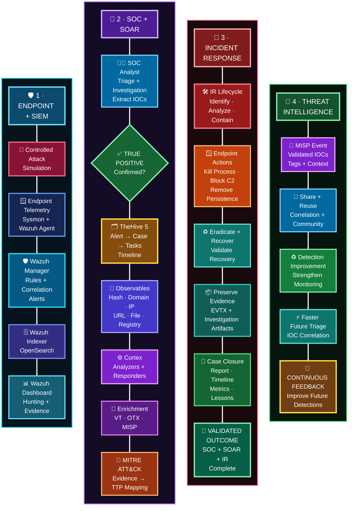

<!-- ===================== HEADER ===================== -->

<h1 align="center">
  
  Hi, I'm Abdul Rehman
  
</h1>

<div align="center">
  
</div>


<h3 align="center">
🛡 SOC Analyst • 🔍 Detection Engineering • ⚙️ Security Automation • ☁️ AWS Security • 🤖 AI-Driven SOC
</h3>

<p align="center">
  
</p>

<p align="center">
  
  
</p>

<p align="center">
  <code>Telemetry → Detection → Enrichment → Case Management → Automation → Feedback</code>
</p>

<p align="center">
  
  
</p>

<p align="center">
  
  
  
  
  
  
</p>

<hr>

<!-- ===================== CONNECT ===================== -->

## 🌐 Connect with Me

<p align="center">
  <a href="https://twitter.com/abdul4rehman215">
     
  </a>
  <a href="https://linkedin.com/in/abdul4rehman215">
     
  </a>
  <a href="https://instagram.com/abdul4rehman215">
    
  </a>
  <a href="https://fb.com/abdul4rehman215">
    
  </a>
  <a href="https://linktr.ee/abdul4rehman215">
    
  </a>
</p>

<p align="center">
  <a href="https://wa.me/917848040230">
    
  </a>
  <a href="mailto:abdul4rehman215@gmail.com">
    
  </a>
  <a href="https://github.com/abdul4rehman215">
    
  </a>

  <a href="https://discord.com/users/abdul4rehman215">
    
  </a> 

</p>

<hr>

<!-- ===================== ABOUT ME ===================== -->

## 👨‍💻 About Me


```yaml
Name: Abdul Rehman
Role: SOC Analyst | Cybersecurity Analyst | Security Automation Builder
Location: Bengaluru, India 🇮🇳

Primary Focus:
  - SOC Operations & SIEM Monitoring
  - Detection Engineering & Alert Triage
  - Incident Response & Case Workflows
  - AWS Security Monitoring & IAM Automation
  - SOAR Workflows with Wazuh, TheHive, MISP, Cortex, n8n
  - AI-Assisted Security Operations

Current Growth Tracks:
  - Defensive Security Engineering
  - Advanced SOC Operations
  - DevSecOps & Cloud Security
  - AI-Driven Security Operations
  - AI Automation & Agentic Workflows
  - Cybersecurity + AI Practical Lab Roadmap

Approach: Build → Detect → Investigate → Automate → Document → Improve
Philosophy: Automate Everything
Goal: Strengthen security operations through practical automation and AI-assisted workflows
🌐 Open to remote roles & freelance

```

I’m a **hands-on cybersecurity practitioner** focused on **SOC operations, SIEM monitoring, detection engineering, AWS security, incident response workflows, and open-source security tooling**.

My portfolio is built around **real lab execution and deep documentation** — not just learning tools, but **deploying, validating, investigating, automating, documenting, and improving complete technical environments**.

Over time, I’ve built and documented work across:

* **SOC & SIEM operations**
* **Wazuh-based monitoring, detection, and alert triage**
* **TheHive, MISP, Cortex, and n8n-based SOAR workflows**
* **AWS security monitoring, IAM automation, and secure cloud infrastructure**
* **Linux security hardening, administration, and troubleshooting**
* **Incident response simulations, containment workflows, and case documentation**
* **Python automation, DevSecOps-style validation, and observability workflows**
* **AI-assisted SOC workflows, GenAI security operations, MCP/RAG learning, and agentic automation experiments**
* **Data science, machine learning, NLP, and analytics foundations for security-adjacent analysis**

I also completed a **full-year student internship** alongside my cybersecurity studies and continue building a **large, structured GitHub portfolio** through completed labs, specialist repositories, capstone-style projects, and an active long-term hands-on learning roadmap.

<hr>

<!-- ===================== PORTFOLIO SNAPSHOT ===================== -->

## 📌 Portfolio Snapshot

<div align="center">

| 🔐 Portfolio Dimension | 📈 What It Reflects |
| --- | --- |
| **28 structured repositories** | Specialist tracks, capstones, guided labs, learning portfolios, and documentation-first technical projects |
| **700+ completed hands-on labs & projects** | Practical execution already completed across cybersecurity, Linux, cloud, automation, analytics, AI, and security operations |
| **720-lab advanced roadmap** | Active next-stage roadmap across blue team, red team, DFIR, cloud security, DevSecOps, AI security, ML, automation, and advanced cyber labs |
| **SOC/SOAR flagship ecosystem** | 30+ projects, 6 capstones, 11 installations/setups, 6 dashboards, and connected Wazuh + TheHive + MISP + Cortex + n8n workflows |
| **Cloud security engineering** | AWS IAM security automation, secure infrastructure MVP, CloudTrail, GuardDuty, Config, Security Hub, VPC Flow Logs, and monitoring pipelines |
| **AI-assisted security automation** | GenAI detection-as-code, MCP/RAG/agentic AI security workflows, Hugging Face agents, LangChain RAG, and n8n-based SOC automation |
| **Python, data & automation depth** | 57-lab Data Science portfolio and 39-lab Python automation/security engineering portfolio |
| **Documentation-first mindset** | READMEs, architecture diagrams, workflow mapping, interview Q&A, troubleshooting, evidence packs, and technical reporting |
</div>

<hr>

<!-- ===================== FULL SKILL MATRIX ===================== -->

## 📊 Full Skill Matrix

This matrix reflects my **portfolio-wide hands-on implementation** across SOC operations, SIEM, Linux security, AWS monitoring, incident response, security automation, AI-assisted security workflows, Python engineering, and analytics.

> Depth labels are evidence-based and reflect completed repositories, capstones, labs, workflow prototypes, and documented hands-on projects.

| Skill Area | Portfolio Evidence | Current Depth | Tools / Frameworks Used |
|---|---|---|---|
| 🛡️ SOC Operations & Alert Triage | Alert triage, investigation logic, false-positive review, escalation context, analyst-style documentation | **`High portfolio depth`** | Wazuh, TheHive, MITRE ATT&CK |
| 📊 SIEM Monitoring & Detection Engineering | Wazuh monitoring, custom rules, decoders, FIM, telemetry validation, tuning, and detection-focused workflows | **`High portfolio depth`** | Wazuh, ELK, Kibana, Sysmon, auditd |
| 🧾 Incident Response & Case Documentation | Alert-to-case thinking, timelines, containment notes, response lifecycle, lessons learned, closure documentation | **`Strong applied exposure`** | TheHive, Cortex, MISP, SOC reporting workflows |
| 🧠 Threat Intelligence & ATT&CK Mapping | IOC enrichment, ATT&CK mapping, observable handling, case context, threat-intel feedback loops | **`Strong applied exposure`** | MISP, Cortex, VirusTotal, AlienVault OTX, MITRE ATT&CK |
| 🐧 Linux Security & System Hardening | SSH hardening, permissions, services, auditing, logging, firewalling, credential access monitoring | **`High portfolio depth`** | Linux, Ubuntu, Debian, RHEL, auditd, ufw, fail2ban |
| ☁️ AWS Security Monitoring & Cloud Visibility | CloudTrail monitoring, IAM activity review, GuardDuty/Security Hub-style workflows, cloud event visibility | **`Strong applied exposure`** | AWS, CloudTrail, IAM, GuardDuty, Security Hub, AWS CLI |
| ☁️ AWS Security Engineering & IAM Automation | IAM triage, containment workflows, scheduled IAM hygiene, secure infrastructure MVPs, assessment/remediation automation | **`Growing specialist depth`** | AWS IAM, Security Hub, GuardDuty, CloudTrail, Config, VPC Flow Logs |
| 🧬 GenAI Security & Detection-as-Code | AI-app telemetry detection, Wazuh rule CI/CD, MCP/RAG/agentic runtime triage, OWASP LLM mapping | **`Applied / growing depth`** | Wazuh, GitHub PRs, n8n, TheHive, Slack, OWASP LLM, MCP, RAG |
| ⚙️ Python Security Automation & DevSecOps | CLI tooling, config validation, testing, backend orchestration, workflow state, logs, metrics, incident-support automation | **`Strong applied exposure`** | Python, Bash, FastAPI, Flask, pytest, PostgreSQL, Redis, Prometheus, Grafana |
| 🤖 AI Automation, Agents, MCP & RAG | n8n workflows, prompt/context design, LangChain RAG apps, Hugging Face agents, MCP servers, tool-use workflows | **`Applied / growing depth`** | n8n, LangChain, Hugging Face, FastMCP, smolagents, LlamaIndex, LangGraph |
| 🧪 Vulnerability Assessment & Security Validation | Vulnerability review, scan interpretation, hardening validation, posture improvement, remediation thinking | **`Strong applied exposure`** | Nessus, OpenVAS, Checkov, CIS concepts, OWASP ZAP |
| 🌐 Web / Network Security Observation | Traffic review, service visibility, WAF monitoring, IDS/NSM visibility, web log observation | **`Solid working depth`** | Wireshark, Nmap, Burp Suite, OWASP ZAP, Nginx, Suricata, Snort, Zeek |
| 🎩 RHEL, Containers & Admin Automation | Enterprise-style administration exposure, container workflows, operational consistency, system management | **`Solid working depth`** | RHEL, Podman, Docker, Kubernetes, OpenShift |
| 📈 Data Analytics, ML/NLP & Security-Oriented Analysis | Data handling, visualization, statistics, ML/NLP foundations, forecasting, deep learning foundations | **`Solid working depth`** | Jupyter, Pandas, NumPy, Matplotlib, scikit-learn, TensorFlow, PyTorch |

## 🔍 Depth Scale

- **High portfolio depth** = repeated implementation across multiple repositories, labs, capstones, and documented workflows
- **Strong applied exposure** = clear practical project evidence with hands-on implementation and technical documentation
- **Growing specialist depth** = active specialization supported by recent capstone or repository work
- **Applied / growing depth** = hands-on projects completed, with continued expansion underway
- **Solid working depth** = practical foundation with documented labs and ongoing growth

This matrix reflects **overall portfolio capability**, not one isolated repository — covering:

> SOC → Detection → Investigation → Enrichment → Hardening → Monitoring → Automation → Documentation → Continuous Improvement

<hr>

<!-- ===================== CORE FOCUS ===================== -->

## 🎯 Core Focus Areas

<div align="center">

| 🧭 Domain | 🔍 Focus |
| --- | --- |
| **SOC Operations** | alert triage, case context, event analysis, escalation thinking, documentation, and analyst workflow discipline |
| **SIEM & Detection Engineering** | Wazuh monitoring, rules, decoders, FIM, telemetry validation, detection tuning, and alert quality improvement |
| **Incident Response Workflows** | investigation flow, containment logic, IOC enrichment, MITRE ATT&CK mapping, reporting, and lessons learned |
| **Threat Intelligence & Case Enrichment** | MISP, Cortex, VirusTotal, OTX, observable context, case comments, and threat-intel feedback loops |
| **Linux Security** | hardening, SSH security, permissions, auditing, services, endpoint visibility, and system defense |
| **AWS Security & IAM Automation** | CloudTrail, IAM activity, GuardDuty, Security Hub, Config, identity triage, containment, and hygiene monitoring |
| **Secure Cloud Infrastructure** | segmented AWS architecture, bastion access, encrypted logging, monitoring controls, validation, and remediation |
| **Security Automation / SOAR** | n8n, Slack, TheHive, DataTables, workflow state, alert-to-case automation, and closure synchronization |
| **AI Security & GenAI Detection** | AI-app telemetry, OWASP LLM mapping, MCP/RAG/agentic runtime detection, Wazuh detection-as-code, and SOC triage prototypes |
| **Python Automation & DevSecOps** | secure CLI tooling, backend orchestration, validation, testing, observability, metrics, and evidence generation |
| **Security Analytics** | data thinking, statistics, ML/NLP foundations, dashboards, forecasting, and security-oriented analytical reasoning |

</div>

<hr>

<!-- ===================== FEATURED PROJECTS ===================== -->

## 🚀 Featured Portfolio Highlights

<div align="center">

| Highlight | What It Shows |
| --- | --- |
| 🛡 **End-to-End SOC + SOAR Ecosystem on AWS** | Connected security operations lab using Wazuh, TheHive, MISP, Cortex, n8n, AWS, dashboards, case workflows, and analyst-style documentation |
| 🔎 **Detection Engineering & Cyber Defense Portfolio** | Endpoint, network, web, cloud, Linux, Windows, Wazuh rules/decoders, validation workflows, and alert-quality improvement |
| ☁️ **AWS Security & IAM Automation** | CloudTrail visibility, IAM triage, GuardDuty/Security Hub-style workflows, secure infrastructure, Config, VPC Flow Logs, and remediation automation |
| 🧬 **GenAI Detection-as-Code & AI Security Workflows** | Wazuh CI/CD, GitHub PR validation, OWASP LLM mapping, MCP/RAG/agentic runtime telemetry, Slack, TheHive, n8n, and audit tables |
| ⚙️ **Python Automation, DevSecOps & Observability** | 39-lab Python automation engineering portfolio covering CLI tools, backend workflows, testing, logs, metrics, compliance evidence, and AI-assisted runbooks |
| 📊 **Data Science, ML/NLP & Analytics Foundations** | 57-lab Data Science portfolio covering Python, pandas, NumPy, visualization, statistics, ML, NLP, forecasting, TensorFlow, and PyTorch |
| 🤗 **AI, Hugging Face, LangChain & MCP Learning** | Hugging Face Agents/LLM/MCP tracks, LangChain RAG app work, MCP automation workflows, AI agents, and source-grounded chatbot development |
| 📝 **Documentation-First Portfolio Discipline** | Strong READMEs, architecture diagrams, troubleshooting notes, interview Q&A, evidence packs, project reports, and technical storytelling |

</div>

<hr>

<!-- ===================== FUTURE VISION ===================== -->

## 🚀 Future Vision

I am working toward becoming a stronger **cybersecurity professional** who can improve security operations through **defensive engineering, automation, cloud security, and practical AI-assisted workflows**.

My long-term direction is to build useful security systems that connect:

* **SOC monitoring and detection engineering**
* **incident response and case workflow discipline**
* **cloud security, IAM visibility, and DevSecOps-style validation**
* **Python automation, observability, and evidence-driven reporting**
* **AI-assisted triage, agentic workflows, MCP/RAG learning, and human-in-the-loop automation**

The goal is not to automate everything blindly. The goal is to automate the repetitive, high-context, and evidence-heavy work that can help analysts move faster while keeping security decisions explainable and reviewable.

<hr>


<!-- ===================== TECHNICAL SKILLS ===================== -->

## 🛠 Technical Skills

<details>
<summary><b>🚀 Click to Expand / Collapse Technical Skills</b></summary>

### ☁️ Cloud & Platform Security

<p align="left">
  
  
  
  
  
  
  
  
  
  
  
</p>

### 🐳 Containers & Runtime

<p align="left">
  
  
  
  
</p>

### 🔐 Security, SOC & Threat Detection

<p align="left">
  
  
  
  
  
  
  
  
  
  
  
  
  
  
  
  
</p>

### 📊 SIEM, Logging & Case Management

<p align="left">
  
  
  
  
  
  
  
  
  
  
</p>

### 🌐 Networking & Traffic Analysis

<p align="left">
  
  
  
  
  
  
</p>

### 🐧 Operating Systems

<p align="left">
  
  
  
  
  
  
</p>

### 🧪 Programming, Automation & Analysis

<p align="left">
  
  
  
  
  
  
  
  
</p>

### 🧩 Backend, DevSecOps & Observability

<p align="left">
  
  
  
  
  
  
  
  
</p>

### ☕ Java & Integration Development

<p align="left">
  
  
  
</p>

### 🤖 AI Automation, Agentic Workflows & Prompting

<p align="left">
  
  
  
  
  
  
  
  
  
  
  
</p>

### 📈 Data Science, ML & Security Analytics

<p align="left">
  
  
  
  
  
  
  
  
  
  
  
</p>

</details>

<hr>

<!-- ===================== WHAT I WORK ON ===================== -->

## 🛡 What I Work On

<div align="center">

| Area | Practical Work |
| --- | --- |
| 🔍 **SOC Operations & SIEM Monitoring** | Alert triage, log analysis, Wazuh monitoring, detection review, escalation logic, and analyst-ready notes |
| 🧠 **Threat Intelligence & Case Context** | IOC enrichment, MISP/Cortex workflows, VirusTotal/OTX checks, ATT&CK mapping, and case comments |
| 🐧 **Linux Security & Administration** | Hardening, permissions, SSH security, audit visibility, services, logs, firewalling, and troubleshooting |
| ☁️ **AWS Security & IAM Automation** | CloudTrail visibility, IAM event review, identity triage, hygiene checks, GuardDuty/Security Hub-style workflows |
| 🏰 **Secure Cloud Infrastructure** | Segmented AWS architecture, bastion patterns, least-privilege IAM, encrypted logging, assessment, remediation, and monitoring controls |
| 🧬 **GenAI Detection-as-Code** | Wazuh detection CI/CD, AI-app telemetry, OWASP LLM mapping, MCP/RAG/agentic alert routing, and TheHive case workflows |
| 🤖 **AI Automation & n8n Workflows** | Prompt/context design, Slack notifications, analyst summaries, workflow orchestration, DataTables, and closure sync |
| ⚙️ **Python Automation & DevSecOps** | CLI tools, API services, validation gates, testing, drift checks, logs, metrics, dashboards, and evidence generation |
| 📊 **Data Science & ML/NLP Foundations** | Python analytics, data cleaning, visualization, statistics, ML/NLP basics, forecasting, and model-evaluation practice |

</div>

<hr>

<!-- ===================== CERTIFICATIONS ===================== -->

## 🏅 Certifications & Professional Training

### ☁️ Cloud, Cybersecurity & Governance

* **Cloud Cyber Security Certificate** — *Al-Nafi International College* *(issued Jan 2026)*
* **EduQual RQF Level 3 Diploma in Cloud Cyber Security** — *Al-Nafi International College*
* **Cyber Security Internship** — *Al-Nafi International College*
* **CISSP-aligned Training** — *Al-Nafi International College*
* **Certified in Cybersecurity (CC)** — *ISC2*
* **ISO/IEC 27001:2022 Lead Auditor** — *Mastermind*
* **Certified Fundamentals in Cybersecurity** — *Fortinet*

### 🛡️ SOC, Threat Intelligence, Job Simulations & Security Practice

* **SOC Analyst & Cybersecurity Job Simulations** — *Forage* *(TATA, Deloitte, AIG, Datacom, Telstra, Commonwealth Bank)*
* **Certified Phishing Prevention Specialist (CPPS)** — *Hack & Fix*
* **Certified Threat Intelligence & Governance Analyst (CTIGA)** — *Red Team Leaders*
* **Certified Red Team Operations Management (CRTOM)** — *Red Team Leaders*
* **Cybersecurity Fundamentals, SOC in Practice, Enterprise Security, Threat Intelligence & Hunting** — *IBM SkillsBuild*

### 🤖 AI, MCP, Agents & Automation

* **Hugging Face AI Learning Tracks** — *Agents Course, LLM Fundamentals, Fundamentals of MCP, MCP for Production Automation*
* **Anthropic AI Fluency & Claude Learning** — *AI Fluency, Claude 101, Claude Code 101, Claude Code in Action, Claude Cowork*
* **Anthropic MCP / Agentic Workflow Certificates** — *Introduction to MCP, MCP Advanced Topics, Subagents, Agent Skills*
* **AI Masterclass & Workshops** — *Dhruv Rathee Academy, GrowthSchool, be10x*
* **AWS DevOps and Agentic AI Masterclass** — *Train with Shubham*

### 📊 Data, Analytics & Technical Foundations

* **Data Analytics Essentials** — *Cisco Networking Academy*
* **Introduction to Data Science** — *Cisco Networking Academy*

<p align="center">
   <a href="https://www.credly.com/users/abdul4rehman215" target="_blank">
    
  </a>
   <a href="https://www.credly.com/users/abdul4rehman215" target="_blank">
    
  </a>
</p>

<hr>

<!-- ===================== PROFESSIONAL FOCUS ===================== -->
<h2>💼 Professional Focus</h2>

<table width="100%">
  <tr>
    <th width="35%" align="left">🧭 Current Strengths</th>
    <th width="65%" align="left">🚀 Areas I’m Actively Advancing</th>
  </tr>
  <tr>
    <td valign="top" width="40%">
      <strong>SOC Operations, Defensive Security &amp; Automation</strong>
      <ul>
        <li>SOC alert monitoring, triage, investigation logic, and analyst-style documentation</li>
        <li>SIEM monitoring and detection engineering using <strong>Wazuh</strong>, rules, decoders, and telemetry validation</li>
        <li>Threat detection, IOC context, enrichment, and <strong>MITRE ATT&amp;CK</strong> mapping</li>
        <li>Incident escalation, case workflow documentation, containment thinking, and closure tracking</li>
        <li>Linux security, log analysis, hardening, audit visibility, and operational administration</li>
        <li>AWS monitoring and identity-security workflow exposure through CloudTrail, IAM, GuardDuty, Security Hub, and Config-style projects</li>
        <li>Open-source SOC ecosystem implementation with <strong>Wazuh + TheHive + MISP + Cortex + n8n</strong></li>
        <li>Python/Bash automation, workflow support, and documentation-first project execution</li>
      </ul>
    </td>
    <td valign="top" width="60%">
      <strong>Security Growth, Engineering Depth &amp; AI Automation Direction</strong>
      <ul>
        <li>Deepening detection logic, alert quality tuning, and stronger SOC decision-making</li>
        <li>Expanding Wazuh depth through custom rules, decoders, deployment control, regression testing, and dashboard visibility</li>
        <li>Advancing cloud security engineering around AWS IAM, secure infrastructure, posture monitoring, and remediation workflows</li>
        <li>Building stronger Python automation, DevSecOps validation, backend workflow services, observability, and evidence generation</li>
        <li>Growing in <strong>GenAI security workflows</strong>, detection-as-code, MCP/RAG/agentic AI risk detection, and AI-app telemetry monitoring</li>
        <li>Learning advanced AI workflow implementation with <strong>Hugging Face</strong>, <strong>LangChain</strong>, <strong>MCP</strong>, agents, and human-in-the-loop automation</li>
        <li>Working through a new <strong>720-lab advanced roadmap</strong> across blue team, red team, DFIR, cloud security, DevSecOps, AI, ML, and automation domains</li>
        <li>Strengthening documentation quality, project storytelling, architecture explanation, and portfolio presentation</li>
        <li>Moving toward stronger cybersecurity practice through reliable, explainable, and practical AI-assisted security automation</li>
      </ul>
    </td>
  </tr>
</table>

<hr />

<!-- ===================== FEATURED CAPSTONE PROJECTS ===================== -->
<h2>🚀 Featured Capstone Projects</h2>

<table>
  <tr>
    <th width="50%">🛡️ SOC + SOAR Malware Incident Response</th>
    <th width="50%">🤖 AI-Driven SOC Alert Triage Automation</th>
  </tr>
  <tr>
    <td valign="top">
      <strong>🔎 Alert → Investigation → Case → Threat Intel</strong>
      <ul>
        <li>Built a complete SOC/SOAR malware investigation workflow on AWS</li>
        <li>Used Windows endpoint telemetry, Sysmon, Wazuh, TheHive, Cortex, and MISP</li>
        <li>Practiced triage, validation, enrichment, ATT&amp;CK mapping, case handling, and IOC sharing</li>
        <li>Documented the full incident lifecycle in an interview-ready portfolio format</li>
      </ul>
      <p align="left">
        <a href="https://github.com/abdul4rehman215/SOC-SOAR-ECOSYSTEM-AWS/tree/main/19-capstone-soc-soar-malware-incident-response">
          
        </a>
      </p>
    </td>
    <td valign="top">
      <strong>⚙️ Wazuh → n8n → Gemini → Analyst Report</strong>
      <ul>
        <li>Forwarded Wazuh alerts into n8n for AI-assisted triage</li>
        <li>Normalized alert context and generated analyst-ready summaries using Gemini</li>
        <li>Focused on reducing manual triage effort and improving decision support</li>
        <li>Practiced prompt/context design for SOC workflow acceleration</li>
      </ul>
      <p align="left">
        <a href="https://github.com/abdul4rehman215/SOC-SOAR-ECOSYSTEM-AWS/tree/main/20-ai-driven-soc-alert-triage-automation">
          
        </a>
      </p>
    </td>
  </tr>

  <tr>
    <th width="50%">☁️ AWS IAM Identity Security Automation</th>
    <th width="50%">🏰 Secure AWS Infrastructure MVP</th>
  </tr>
  <tr>
    <td valign="top">
      <strong>🔐 Identity Finding → Enrichment → Containment → Closure</strong>
      <ul>
        <li>Designed a four-flow AWS IAM security automation prototype</li>
        <li>Connected identity triage, IAM enrichment, access-key containment, TheHive alert/case handling, and closure sync</li>
        <li>Used n8n, AWS GuardDuty/Security Hub/IAM/CloudTrail concepts, Slack, DataTable, and TheHive 5</li>
        <li>Demonstrated SOC lifecycle thinking for cloud identity incidents and IAM hygiene monitoring</li>
      </ul>
      <p align="left">
        <a href="https://github.com/abdul4rehman215/SOC-SOAR-ECOSYSTEM-AWS/tree/main/24-aws-iam-identity-security-automation-capstone">
          
        </a>
      </p>
    </td>
    <td valign="top">
      <strong>🧱 Build → Govern → Assess → Remediate → Monitor</strong>
      <ul>
        <li>Built a secure-by-design AWS infrastructure MVP using a layered defense model</li>
        <li>Implemented public/private subnet separation, bastion access, IAM guardrails, encrypted logging, and monitoring controls</li>
        <li>Used Terraform, Python automation, Checkov, CloudTrail, VPC Flow Logs, AWS Config, GuardDuty, EventBridge, and SNS</li>
        <li>Focused on secure cloud architecture, validation, remediation, and continuous visibility</li>
      </ul>
      <p align="left">
        <a href="https://github.com/abdul4rehman215/SOC-SOAR-ECOSYSTEM-AWS/tree/main/25-aws-secure-infrastructure-mvp">
          
        </a>
      </p>
    </td>
  </tr>

  <tr>
    <th width="50%">🧬 GenAI Detection-as-Code CI/CD for Wazuh</th>
    <th width="50%">🧠 GenAI Detection-as-Code V2 — MCP, RAG & Agentic AI</th>
  </tr>
  <tr>
    <td valign="top">
      <strong>🚦 Detection Code → CI Gate → Wazuh Deploy → Runtime Triage</strong>
      <ul>
        <li>Built a GenAI security detection-as-code prototype for Wazuh</li>
        <li>Validated Wazuh XML, Sigma, metadata, mappings, and replay logic through GitHub PR workflows</li>
        <li>Created controlled deployment gates, runtime GenAI alert triage, Slack notifications, TheHive alerts/cases, and audit tables</li>
        <li>Mapped prompt-injection and output-handling detections to OWASP LLM and MITRE ATLAS-style context</li>
      </ul>
      <p align="left">
        <a href="https://github.com/abdul4rehman215/SOC-SOAR-ECOSYSTEM-AWS/tree/main/26-genai-detection-as-code-cicd-wazuh-n8n-thehive">
          
        </a>
      </p>
    </td>
    <td valign="top">
      <strong>🧩 MCP Tool Risk → RAG/Memory Risk → Agentic Runtime Risk</strong>
      <ul>
        <li>Extended the GenAI detection-as-code model into MCP, RAG/memory, and agentic AI security workflows</li>
        <li>Built Flow A2/B2/C2 style validation, deployment, and runtime triage logic using GitHub, Wazuh, n8n, Slack, TheHive, and DataTables</li>
        <li>Added MCP policy monitoring, red-team replay regression, false-positive analytics, and SOC posture metrics</li>
        <li>Documented prototype boundaries honestly while showing practical AI-security engineering depth</li>
      </ul>
      <p align="left">
        <a href="https://github.com/abdul4rehman215/SOC-SOAR-ECOSYSTEM-AWS/tree/main/27-genai-detection-as-code-v2-mcp-rag-agentic-wazuh-n8n-thehive">
          
        </a>
      </p>
    </td>
  </tr>
</table>

<hr />

<!-- ===================== CAPSTONE ARCHITECTURE & WORKFLOW ===================== -->

## 🏗️ Capstone Architecture & Workflow

This section highlights the **original SOC / SOAR malware investigation architecture, analyst workflow, and threat-intelligence feedback loop** using **Wazuh, TheHive, Cortex, MISP, AWS, and Sysmon**. The featured capstone table above shows how the portfolio has expanded further into **AWS IAM automation, secure AWS infrastructure, GenAI detection-as-code, MCP/RAG security, and agentic AI-assisted security operations**.

### 🔍 End-to-End SOC Analyst Workflow

<p align="center">
  
</p>

<details>
<summary><b>🧩 View SOC / SOAR Architecture Pipeline Diagram</b></summary>

<br>

<p align="center">
  
</p>

</details>

<details>
<summary><b>📐 View Mermaid Workflow Diagram</b></summary>

<br>


```mermaid
%%{init: {
  "theme": "base",
  "themeVariables": {
    "background": "#030712",
    "fontSize": "28px",
    "primaryTextColor": "#ffffff",
    "lineColor": "#f8fafc"
  },
  "flowchart": {
    "nodeSpacing": 46,
    "rankSpacing": 56,
    "curve": "basis"
  }
}}%%

flowchart LR

    %% =====================================================
    %% 1 · ENDPOINT + SIEM
    %% =====================================================
    subgraph DETECT[" "]
        direction TB

        H1["🛡️ 1 · ENDPOINT + SIEM"]

        SIM["🧨 Controlled Attack<br/>Simulation"]

        END["🪟 Endpoint Telemetry<br/>Sysmon + Wazuh Agent"]

        WAZ["🛡️ Wazuh Manager<br/>Rules + Correlation<br/>Alerts"]

        IDX["🗄️ Wazuh Indexer<br/>OpenSearch"]

        DASH["📊 Wazuh Dashboard<br/>Hunting + Evidence"]

        H1 ==> SIM ==> END ==> WAZ ==> IDX ==> DASH
    end


    %% =====================================================
    %% 2 · SOC + SOAR
    %% =====================================================
    subgraph SOAR[" "]
        direction TB

        H2["🐝 2 · SOC + SOAR"]

        SOC["👨‍💻 SOC Analyst<br/>Triage + Investigation<br/>Extract IOCs"]

        GATE{"✅ TRUE POSITIVE<br/>Confirmed?"}

        HIVE["🗂️ TheHive 5<br/>Alert → Case → Tasks<br/>Timeline"]

        OBS["🧬 Observables<br/>Hash · Domain · IP<br/>URL · File · Registry"]

        CORT["⚙️ Cortex<br/>Analyzers + Responders"]

        ENR["🔎 Enrichment<br/>VT · OTX · MISP"]

        MITRE["🧭 MITRE ATT&CK<br/>Evidence → TTP Mapping"]

        H2 ==> SOC ==> GATE ==> HIVE ==> OBS ==> CORT ==> ENR ==> MITRE
    end


    %% =====================================================
    %% 3 · INCIDENT RESPONSE
    %% =====================================================
    subgraph RESPONSE[" "]
        direction TB

        H3["🚨 3 · INCIDENT RESPONSE"]

        IR["🛠️ IR Lifecycle<br/>Identify · Analyze · Contain"]

        ACT["🪟 Endpoint Actions<br/>Kill Process · Block C2<br/>Remove Persistence"]

        REC["♻️ Eradicate + Recover<br/>Validate Recovery"]

        EVID["📦 Preserve Evidence<br/>EVTX + Investigation Artifacts"]

        CLOSE["🧾 Case Closure<br/>Report · Timeline<br/>Metrics · Lessons"]

        OUT["🏁 VALIDATED OUTCOME<br/>SOC + SOAR + IR<br/>Complete"]

        H3 ==> IR ==> ACT ==> REC ==> EVID ==> CLOSE ==> OUT
    end


    %% =====================================================
    %% 4 · THREAT INTELLIGENCE
    %% =====================================================
    subgraph INTEL[" "]
        direction TB

        H4["🧠 4 · THREAT INTELLIGENCE"]

        MISP["📌 MISP Event<br/>Validated IOCs<br/>Tags + Context"]

        SHARE["🔁 Share + Reuse<br/>Correlation + Community"]

        IMP["♻️ Detection Improvement<br/>Strengthen Monitoring"]

        FAST["⚡ Faster Future Triage<br/>IOC Correlation"]

        LOOP["🔄 CONTINUOUS FEEDBACK<br/>Improve Future Detections"]

        H4 ==> MISP ==> SHARE ==> IMP ==> FAST ==> LOOP
    end


    %% =====================================================
    %% KEEP ALL 4 COLUMNS PARALLEL
    %% =====================================================
    DETECT ==> SOAR
    SOAR ==> RESPONSE
    RESPONSE ==> INTEL


    %% =====================================================
    %% PREMIUM GLOSSY HEADERS
    %% =====================================================
    classDef detectHeader fill:#0c4a6e,stroke:#67e8f9,stroke-width:6px,color:#ffffff,font-size:32px;
    classDef soarHeader fill:#4c1d95,stroke:#d8b4fe,stroke-width:6px,color:#ffffff,font-size:32px;
    classDef responseHeader fill:#7f1d1d,stroke:#fda4af,stroke-width:6px,color:#ffffff,font-size:32px;
    classDef intelHeader fill:#14532d,stroke:#86efac,stroke-width:6px,color:#ffffff,font-size:32px;

    class H1 detectHeader;
    class H2 soarHeader;
    class H3 responseHeader;
    class H4 intelHeader;


    %% =====================================================
    %% ENDPOINT + SIEM COLORS
    %% =====================================================
    classDef attack fill:#881337,stroke:#fb7185,stroke-width:5px,color:#ffffff,font-size:28px;

    classDef endpoint fill:#172554,stroke:#60a5fa,stroke-width:5px,color:#ffffff,font-size:28px;

    classDef wazuh fill:#075985,stroke:#22d3ee,stroke-width:6px,color:#ffffff,font-size:29px;

    classDef indexer fill:#312e81,stroke:#818cf8,stroke-width:5px,color:#ffffff,font-size:28px;

    classDef dashboard fill:#155e75,stroke:#67e8f9,stroke-width:5px,color:#ffffff,font-size:28px;

    class SIM attack;
    class END endpoint;
    class WAZ wazuh;
    class IDX indexer;
    class DASH dashboard;


    %% =====================================================
    %% SOC + SOAR COLORS
    %% =====================================================
    classDef analyst fill:#0369a1,stroke:#7dd3fc,stroke-width:5px,color:#ffffff,font-size:28px;

    classDef decision fill:#166534,stroke:#86efac,stroke-width:6px,color:#ffffff,font-size:28px;

    classDef hive fill:#854d0e,stroke:#fde047,stroke-width:6px,color:#ffffff,font-size:29px;

    classDef observable fill:#4338ca,stroke:#a5b4fc,stroke-width:5px,color:#ffffff,font-size:28px;

    classDef cortex fill:#7e22ce,stroke:#f0abfc,stroke-width:5px,color:#ffffff,font-size:28px;

    classDef enrich fill:#581c87,stroke:#e879f9,stroke-width:5px,color:#ffffff,font-size:28px;

    classDef mitre fill:#9a3412,stroke:#fdba74,stroke-width:5px,color:#ffffff,font-size:28px;

    class SOC analyst;
    class GATE decision;
    class HIVE hive;
    class OBS observable;
    class CORT cortex;
    class ENR enrich;
    class MITRE mitre;


    %% =====================================================
    %% INCIDENT RESPONSE COLORS
    %% =====================================================
    classDef ir fill:#991b1b,stroke:#fb7185,stroke-width:6px,color:#ffffff,font-size:29px;

    classDef action fill:#c2410c,stroke:#fdba74,stroke-width:5px,color:#ffffff,font-size:28px;

    classDef recovery fill:#0f766e,stroke:#5eead4,stroke-width:5px,color:#ffffff,font-size:28px;

    classDef evidence fill:#115e59,stroke:#2dd4bf,stroke-width:5px,color:#ffffff,font-size:28px;

    classDef closure fill:#166534,stroke:#4ade80,stroke-width:5px,color:#ffffff,font-size:28px;

    classDef outcome fill:#065f46,stroke:#86efac,stroke-width:6px,color:#ffffff,font-size:29px;

    class IR ir;
    class ACT action;
    class REC recovery;
    class EVID evidence;
    class CLOSE closure;
    class OUT outcome;


    %% =====================================================
    %% THREAT INTELLIGENCE COLORS
    %% =====================================================
    classDef misp fill:#7e22ce,stroke:#f0abfc,stroke-width:5px,color:#ffffff,font-size:28px;

    classDef sharing fill:#0369a1,stroke:#7dd3fc,stroke-width:5px,color:#ffffff,font-size:28px;

    classDef improve fill:#15803d,stroke:#86efac,stroke-width:5px,color:#ffffff,font-size:28px;

    classDef future fill:#0f766e,stroke:#5eead4,stroke-width:5px,color:#ffffff,font-size:28px;

    classDef feedback fill:#713f12,stroke:#fde047,stroke-width:6px,color:#ffffff,font-size:28px;

    class MISP misp;
    class SHARE sharing;
    class IMP improve;
    class FAST future;
    class LOOP feedback;


    %% =====================================================
    %% PREMIUM GLOSSY PARALLEL PANELS
    %% =====================================================
    style DETECT fill:#06131d,stroke:#22d3ee,stroke-width:4px

    style SOAR fill:#140b24,stroke:#c084fc,stroke-width:4px

    style RESPONSE fill:#18090d,stroke:#fb7185,stroke-width:4px

    style INTEL fill:#07140d,stroke:#4ade80,stroke-width:4px


    %% =====================================================
    %% THICK BRIGHT CONNECTORS
    %% =====================================================
    linkStyle default stroke:#f8fafc,stroke-width:5px;
```
</details> <hr> 

<!-- ===================== GITHUB ANALYTICS ===================== -->

## 🏆 GitHub Trophies

<p align="center">
  <a href="https://github.com/ryo-ma/github-profile-trophy">
    
  </a>
</p>

---

## 📊 GitHub Analytics

<p align="center">
  
  
</p>
<p align="center">
  
</p>

<p align="center">
  
</p>

<!--
<p align="center">
   
</p>

<p align="center">
   
</p>

<p align="center">
  
</p>
-->

<details>
<summary><b>📈 More GitHub Metrics</b></summary>

<p align="center">
  
</p>

<p align="center">
  
  
</p>

</details>

<hr>

<!-- ===================== TOOLSET ===================== -->

## 🔧 Complete Toolset Reference

<details>
<summary><b>🛠️ Monitoring, Detection & Logging Arsenal (Click to expand)</b></summary>

### 🔎 SIEM & Monitoring Platforms

* **Wazuh** — SIEM/XDR, endpoint monitoring, FIM, vulnerability detection, custom rules, decoders, and alert routing
* **ELK Stack** — Elasticsearch, Logstash, Kibana
* **OpenSearch** — dashboarding and search-style visibility exposure
* **Kibana** — dashboards, visualization, and security monitoring views
* **Splunk** — log analysis and operational visibility
* **CloudTrail** — AWS activity visibility and event review
* **VPC Flow Logs** — cloud network visibility
* **AWS Config** — compliance posture and configuration visibility
* **GuardDuty / Security Hub** — AWS security finding and routing concepts

### 🗂️ Log Collection & Analysis

* **Elasticsearch** — log indexing and search
* **Logstash** — ingestion and parsing
* **Wazuh Decoders & Rules** — event classification and alerting logic
* **Wazuh Custom Integrations** — forwarding security alerts into automation workflows
* **auditd** — Linux audit logging
* **Sysmon / Sysmon for Linux** — endpoint telemetry and event visibility
* **Osquery** — endpoint state inspection and threat-hunting visibility
* **Syslog / Linux Logs** — operational and security visibility
* **Alert Tuning Concepts** — relevance filtering and signal improvement

### 🧠 Threat Intelligence & SOC Context

* **TheHive 5** — incident, alert, case, task, comment, and lifecycle management
* **MISP** — IOC enrichment and sharing concepts
* **Cortex** — analyzer-oriented enrichment support
* **VirusTotal / AlienVault OTX** — external IOC enrichment
* **MITRE ATT&CK** — technique mapping and analyst context
* **MITRE ATLAS-style mapping** — AI threat-context language for GenAI security detections
* **OWASP LLM / GenAI Security** — LLM risk classification and AI-app security reference
* **OWASP MCP** — MCP-specific AI tool-risk reference

</details>

<details>
<summary><b>🔒 Network Security, Traffic Analysis & Security Testing Tools (Click to expand)</b></summary>

### 🛡️ Network Security

* **pfSense** — firewall and network edge concepts
* **Nginx / Apache** — web stack exposure and log visibility
* **ModSecurity + OWASP CRS** — WAF detection and web attack monitoring
* **Fail2Ban** — automated host-level blocking for repeated attack behavior
* **Wireshark** — traffic inspection and packet analysis
* **tcpdump** — packet capture and CLI-based visibility
* **Nmap** — service enumeration and discovery
* **Suricata / Snort / Zeek** — IDS/NSM visibility, alerting, and protocol-aware detection

### 🔍 Vulnerability & Security Assessment

* **OpenVAS** — vulnerability scanning exposure
* **Qualys** — cloud security and assessment awareness
* **Nessus** — vulnerability review
* **Burp Suite** — web security testing workflows
* **OWASP ZAP** — web application testing exposure
* **Checkov** — infrastructure-as-code security scanning
* **CIS concepts** — baseline hardening and control awareness

### 🔴 Security Testing / Detection Validation

* **Metasploit** — offensive simulation in lab contexts
* **Kali Linux** — testing and research environment
* **Atomic Red Team concepts** — adversary emulation awareness
* **VirusTotal** — file/hash/domain/IP enrichment
* **Custom replay/test events** — detection validation and regression thinking

</details>

<details>
<summary><b>💻 Command Line, Systems, Containers & Automation Stack (Click to expand)</b></summary>

### ☁️ Cloud & Infra Tools

* **AWS CLI** — cloud interaction and operational support
* **AWS IAM** — identity, access, policy, and credential hygiene workflows
* **AWS EC2 / VPC / S3 / CloudWatch** — cloud lab operations and monitoring
* **Terraform** — infrastructure-as-code for secure AWS MVP design
* **EventBridge / SNS** — cloud event routing and notification concepts
* **Ansible** — automation and repeatable administration
* **n8n** — workflow orchestration and SOC/SOAR automation

### 🐳 Container Tools

* **Docker** — container workflows
* **Podman** — daemonless containers
* **kubectl** — Kubernetes CLI exposure
* **OpenShift** — enterprise container platform exposure

### 📜 Scripting & Admin

* **Linux CLI** — core administration and troubleshooting
* **bash** — automation and shell scripting
* **PowerShell** — Windows-side scripting exposure
* **python** — scripting, analytics, backend services, and automation
* **vim / nano** — CLI editing
* **systemctl / journalctl** — service and log management
* **iptables / ufw** — firewall and containment actions

### 🔍 Networking Utilities

* **curl** — HTTP / API checks
* **wget** — downloads and testing
* **netcat (nc)** — networking utility
* **dig** — DNS lookup utility
* **traceroute** — path tracing
* **ping** — connectivity validation
* **ip / ss / netstat** — network inspection

### 🔐 Security Utilities

* **ssh** — secure access and admin workflows
* **openssl** — SSL/TLS tooling
* **fail2ban** — brute-force mitigation
* **ufw** — firewall management
* **SELinux / AppArmor** — access control and hardening exposure

</details>

<details>
<summary><b>🧩 Python Automation, DevSecOps & Observability Stack (Click to expand)</b></summary>

### ⚙️ Python Automation Engineering

* **Python** — CLI tooling, scripts, data processing, workflow support, and service logic
* **Bash** — repeatable execution, validation scripts, and lab automation
* **FastAPI / Flask** — API services, policy/status endpoints, and integration workflows
* **PostgreSQL** — workflow state, job registry, and queryable job history
* **Redis** — queueing and worker-support patterns
* **pytest / coverage** — testing, validation, and quality gates
* **pre-commit** — local quality gate and security checks

### 📦 Delivery, Validation & Governance

* **GitHub / GitHub Actions** — PR workflows, validation signals, CI-style automation, and documentation versioning
* **Artifact versioning** — repeatable delivery and rollback-aware workflow thinking
* **Configuration validation** — schema checks, drift detection, golden config enforcement
* **Policy engineering** — automation guardrails, rule enforcement, and compliance evidence

### 📈 Observability & Evidence

* **Structured Logging** — correlation IDs, JSON logs, and operational traceability
* **Prometheus** — metrics instrumentation
* **Grafana** — dashboard evidence and operational visualization
* **Runbooks / Reports** — incident support, CI triage, evidence generation, and documentation

</details>

<details>
<summary><b>🤖 AI Automation, Workflow Design & Prompting Stack (Click to expand)</b></summary>

### 🧠 AI Automation & Agentic Workflows

* **n8n** — workflow orchestration, node chaining, Slack/TheHive routing, DataTable state, and automation prototypes
* **Gemini API** — AI-assisted SOC triage and RAG application workflows
* **AI Agents** — task-driven automation experiments and tool-use workflows
* **Hugging Face** — agents, LLM fundamentals, MCP learning, Spaces, and model ecosystem practice
* **smolagents / LlamaIndex / LangGraph** — agent and RAG-oriented learning exposure
* **FastMCP / MCP servers** — MCP workflow servers, tools, resources, and automation integrations
* **GitHub Actions + Slack automation** — production-inspired MCP notification and workflow automation practice
* **RAG Basics** — retrieval-augmented generation exposure
* **Vector Workflow Basics** — vector-based retrieval understanding

### ✍️ Prompting & Context Engineering

* **Prompt Engineering** — structuring effective instructions
* **Context Design** — grounding and response quality improvement
* **Workflow Prompt Chaining** — passing instructions across nodes and tasks
* **Human-in-the-Loop Design** — keeping analyst review, approval, and decision quality in automation workflows
* **LLM-Assisted Automation Thinking** — using AI to reduce repetitive operational work responsibly

### 🧬 AI Security & GenAI Detection

* **Detection-as-Code** — detection content validation, deployment gating, and regression thinking
* **OWASP LLM / GenAI risk mapping** — prompt injection, output handling, sensitive disclosure, and excessive agency thinking
* **MCP/RAG/Agentic AI security** — MCP tool misuse, context injection, memory poisoning, retrieval risk, and agentic action monitoring
* **TheHive + Slack + DataTables** — analyst-facing case, notification, and audit evidence handling for AI security alerts

</details>

<details>
<summary><b>📊 Data Science, Analytics & AI Toolkit (Click to expand)</b></summary>

### 🧪 Data Analysis & Exploration

* **Jupyter Notebook / Google Colab** — interactive coding and lab documentation
* **Pandas** — cleaning, filtering, and analysis
* **NumPy** — numerical workflows
* **Regex / JSON / CSV workflows** — practical extraction and data handling
* **Exploratory Data Analysis** — dataset understanding and pattern discovery

### 📈 Visualization & Storytelling

* **Matplotlib** — static charting
* **Seaborn** — statistical visualization
* **Plotly / Bokeh / Dash / Streamlit** — interactive visualization, dashboards, and app-style reporting
* **Folium / GeoJSON** — geospatial visualization exposure
* **Notebook Reporting** — documenting technical insights clearly

### 📊 Statistics & ML Foundations

* **Descriptive Statistics** — summarization and variability analysis
* **Probability Concepts** — statistical reasoning
* **A/B Testing & Hypothesis Testing** — experiment-style analysis
* **scikit-learn** — ML foundations
* **Feature Engineering** — preprocessing and transformation
* **Model Evaluation** — comparing outputs and improving quality

### 🧠 Advanced Learning Foundations

* **NLP Concepts** — text processing and language-oriented workflows
* **Time Series Concepts** — trend and forecasting exposure
* **TensorFlow / Keras / PyTorch** — deep learning foundations
* **CNN / RNN / Transformer Foundations** — computer vision and sequence-model learning exposure
* **Analytical Thinking for Security** — data-backed reasoning for security-adjacent workflows

</details>

<hr>

<!-- ===================== INTERESTS ===================== -->

## 🎯 Interests & Hobbies

<div align="center">

<table width="100%" style="table-layout:fixed;">
<tr>
<th width="50%">🏀 Outdoor & Fitness</th>
<th width="50%">🎮 Gaming (PC)</th>
</tr>

<tr>
<td valign="middle" style="padding:18px 22px;">

🏀 <b>Basketball</b> — agility, movement & teamwork<br>
🏋️ <b>Gym</b> — discipline, consistency & self-improvement<br>
🏊 <b>Swimming</b> — endurance & focus<br>
🐎 <b>Horse Riding</b> — balance, control & confidence

</td>

<td valign="middle" style="padding:18px 22px;">

🚗 <b>GTA V</b> — strategy & exploration<br>
⚽ <b>FIFA</b> — coordination & competitive gameplay

</td>
</tr>
</table>

<br>

<table width="100%" style="table-layout:fixed;">
<tr>
<th width="50%">🧠 Professional Interests</th>
<th width="50%">📚 Continuous Learning</th>
</tr>

<tr>
<td valign="middle" style="padding:18px 22px;">

🛡 <b>SOC Operations & Detection Engineering</b><br>
☁️ <b>AWS Security & IAM Automation</b><br>
🤖 <b>AI Security Automation & SOAR Workflows</b><br>
🧬 <b>GenAI Security, MCP/RAG & Detection-as-Code</b>

</td>

<td valign="middle" style="padding:18px 22px;">

📘 <b>Hands-on labs & portfolio building</b><br>
🧪 <b>Real-world security simulations</b><br>
🧠 <b>Skill growth across SOC, cloud, AI, DevSecOps & automation</b><br>
📈 <b>Analytics-driven technical improvement</b>

</td>
</tr>
</table>

</div>

<hr>

<!-- ===================== LANGUAGES ===================== -->

## 🌍 Languages

<p align="center">
  
  
  
</p>


<!--

### 🟢 Duolingo Language Scores

<p align="center">
  
  
</p>

<p align="center">
  
  
</p>

-->

<hr>

<!-- ===================== PROFESSIONAL SERVICES ===================== -->

<div align="center">
<h2 align="center">
  🤝✨ Let’s Connect, Collaborate & Build Secure Systems ✨🤝
</h2>

<div align="center">
  
</div>


<!-- ===================== PROFESSIONAL SERVICES ===================== -->

## 💼 Professional Services

<div align="center">

- 🔍 **SOC Monitoring & Alert Triage** — Alert review, triage support, escalation notes, and analyst-style reporting.
- 📊 **Wazuh SIEM & Detection Support** — Log visibility, rule/decoder support, dashboard checks, and detection workflow improvement.
- 🧠 **Threat Intelligence & IOC Enrichment** — IOC review, enrichment, ATT&CK mapping, and investigation context building.
- 📝 **Incident Response Documentation** — Case notes, timelines, containment tracking, lessons learned, and response reporting.
- 🐧 **Linux Security Hardening** — SSH hardening, firewall setup, permissions, audit visibility, and service security checks.
- 🌐 **Web & Network Security Visibility** — Web logs, WAF visibility, traffic review, Nmap/Wireshark analysis, and monitoring support.
- 🧪 **Vulnerability Review & Validation** — Finding review, prioritization, hardening recommendations, and remediation documentation.
- 🤖 **AI Security Automation & n8n Workflows** — Alert-to-case automation, AI-assisted triage, Slack/TheHive routing, and workflow prototyping.
- ⚙️ **Python / Bash / DevSecOps Automation** — Helper scripts, log parsing, CLI tools, validation checks, and lightweight automation.
- 📚 **Technical Documentation & Portfolio Writing** — GitHub READMEs, architecture writeups, project documentation, and technical presentation.

</div>

<!-- ===================== REACH OUT ===================== -->

## 📧 Reach Out

<p align="center">
  <a href="https://www.upwork.com/freelancers/~013c81f100fc1492ec">
    
  </a>

  <a href="https://fiverr.com/users/abdul4rehman215">
    
  </a>

  <a href="mailto:abdul4rehman215@gmail.com">
    
  </a>

  <a href="https://wa.me/917848040230">
    
  </a>
</p>

### 🌟 If you find my work interesting, please consider:

<p align="center">
  <a href="https://github.com/abdul4rehman215">
    
  </a>

  <a href="https://www.linkedin.com/comm/mynetwork/discovery-see-all?usecase=PEOPLE_FOLLOWS&followMember=abdul4rehman215" target="_blank">
    
  </a>
  
  <a href="https://www.buymeacoffee.com/abdul4rehman215">
    
  </a>

</p>

<hr>

<!-- ===================== QUOTE ===================== -->

<p align="center">
  <em>
    “In cybersecurity, continuous learning is not optional — it is survival.”
  </em><br>
  — Bruce Schneier
</p>

<p align="center">
  <em>
    “A man who builds from scratch never fears loss, because what made him cannot be taken away: knowledge, experience, and resilience.”
  </em><br>
  — Mastering Manhood
</p>

<!-- ===================== FOOTER ===================== -->


<p align="center">
  
</p>

<p align="center">
  Made with 💙 by <a href="https://github.com/abdul4rehman215">Abdul Rehman</a>
</p>

<p align="center">
  <sub>Last Updated: May 2026</sub>
</p>
